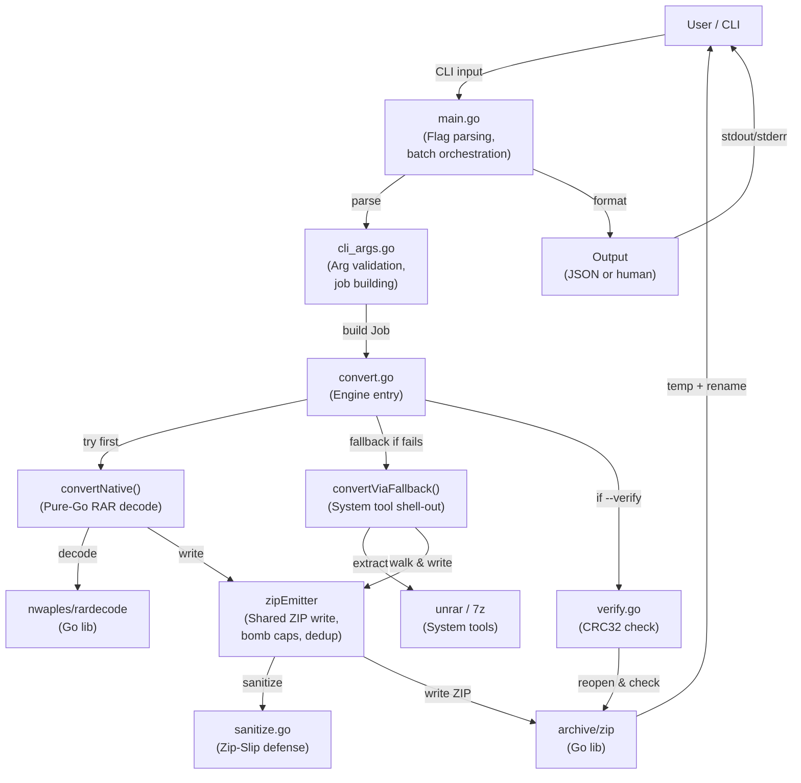

# System Architecture

## Component Diagram



## Data Flow: Single Archive Conversion

```
┌─────────────────────────────────────────────────────────────────┐
│ 1. CLI Parsing (main.go, cli_args.go)                           │
├─────────────────────────────────────────────────────────────────┤
│ • Parse flags (-o, --out-dir, --password, --level, --verify, ...) │
│ • Validate arguments                                             │
│ • Resolve output paths                                           │
│ • Build Job: {InputPath, OutputPath, Password, Flags}          │
└─────────────────────────────────────────────────────────────────┘
                          ↓
┌─────────────────────────────────────────────────────────────────┐
│ 2. Main Conversion (convert.go)                                 │
├─────────────────────────────────────────────────────────────────┤
│ • Check destination (exists? force? writable?)                  │
│ • Try convertNative():                                          │
│   ├─ Open RAR via rardecode/v2                                  │
│   ├─ Iterate entries:                                           │
│   │  ├─ Read entry header + data                                │
│   │  ├─ Sanitize name (Zip-Slip defense)                        │
│   │  ├─ Check bomb caps (size, entry count)                     │
│   │  ├─ Harden permissions (safeMode)                           │
│   │  └─ Stream to temp ZIP via zipEmitter                       │
│   └─ Return success or error                                    │
└─────────────────────────────────────────────────────────────────┘
                          ↓
                    [Did native fail?]
                      ↙          ↘
                   Yes            No
                    ↓              ↓
   ┌──────────────────────┐   ┌──────────────┐
   │ Try convertViaFallback│  │ Skip fallback│
   │ (if --allow-fallback) │  │              │
   └──────────────────────┘   └──────────────┘
         ↓                            ↓
   • Check free space                 │
   • Shell: unrar/7z extract to tmp   │
   • Walk tmp dir                     │
   • Same sanitize + emitter logic    │
         ↓                            │
   ┌─────────────────────────────────┘
   │
   ↓
┌─────────────────────────────────────────────────────────────────┐
│ 3. Finalization (atomic write)                                  │
├─────────────────────────────────────────────────────────────────┤
│ • Set temp file permissions (0644)                              │
│ • Atomic os.Rename(tempFile, destination)                       │
│ • If any error before rename: os.Remove(tempFile)               │
│   → Destination never partial/truncated                         │
└─────────────────────────────────────────────────────────────────┘
                          ↓
                    [--verify set?]
                      ↙          ↘
                   Yes            No
                    ↓              ↓
   ┌──────────────────────┐   ┌──────────────┐
   │ verify():            │  │ Skip verify  │
   │ • Reopen output ZIP  │  │              │
   │ • Check entry count  │  │              │
   │ • Read all entries   │  │              │
   │   to EOF (CRC32)     │  │              │
   └──────────────────────┘   └──────────────┘
         ↓                            ↓
   ┌─────────────────────────────────┘
   │
   ↓
┌─────────────────────────────────────────────────────────────────┐
│ 4. Report & Exit                                                │
├─────────────────────────────────────────────────────────────────┤
│ • Format result (JSON or human)                                 │
│ • Print summary to stdout/stderr                                │
│ • Exit code: 0 (success), 1 (runtime error), 2 (usage error)   │
└─────────────────────────────────────────────────────────────────┘
```

## Batch Processing Flow

```mermaid
graph TB
    Input["Multiple input files<br/>(*.rar)"]
    Batch["RunBatch()"]
    Semaphore["Semaphore<br/>(--jobs limit)"]
    Worker["Worker goroutine<br/>(convert single archive)"]
    Results["Result buffer<br/>(ordered)"]
    Output["Output results<br/>(same order as input)"]
    
    Input -->|[]Job| Batch
    Batch -->|bounded by --jobs| Semaphore
    Semaphore -->|release slot| Worker
    Worker -->|convert| Worker
    Worker -->|result| Results
    Results -->|maintain order| Output
    Output -->|deterministic| User["User"]
```

**Key properties**:
- Concurrent by default: `--jobs` defaults to `min(NumCPU, 4)`
- Continue-on-error: failed archive doesn't abort batch
- Deterministic output: results printed in input order, not completion order
- Exit code: non-zero if any archive failed

## Shared Emitter (Core Security Component)

The `zipEmitter` centralizes all ZIP write logic, ensuring identical hardening on both native and fallback paths:

```
Input Entry
  ↓
[sanitize(name)] → Reject if: empty, absolute, contains ..
  ↓
[checkCount()] → Increment entry count, fail if > --max-entries
  ↓
[resolveName()] → Dedup: rename repeats to (1), (2), ... ; error on non-repeat collisions
  ↓
[safeMode()] → Strip S_IFLNK, S_IFBLK, S_IFCHR bits
  ↓
[cappedWriter] → Stream content via pooled buffer, fail if > --max-size
  ↓
[Output ZIP entry]
```

This single path for all conversions prevents divergence between native and fallback security.

## Security Invariants

### 1. Zip-Slip Defense

**Threat**: Malicious entry names (`../../etc/passwd`) extract outside the intended root.

**Defense**:
```go
func sanitize(name string) (string, error) {
    // Reject empty, absolute, and traversal names
    if name == "" || path.IsAbs(name) || strings.Contains(name, "..") {
        return "", fmt.Errorf("invalid entry name")
    }
    // Clean and normalize
    return path.Clean(name), nil
}
```

**Applied**: All entries, before ZIP write. Both native and fallback.

### 2. Symlink/Device Neutralization

**Threat**: Symlinks/devices extract as-is, becoming attack vectors (e.g., symlink to root files).

**Defense**:
```go
func safeMode(m os.FileMode) os.FileMode {
    // Strip symlink, block device, char device, setuid bits
    m = m & ^(fs.ModeSymlink | fs.ModeDevice | fs.ModeCharDevice | fs.ModeSetuid)
    if m&fs.ModeDir == 0 {
        m |= fs.ModeRegular  // Regular file
    }
    return m
}
```

**Effect**: Symlinks stored as regular files (target text becomes content). Devices skipped. Result is inert data.

### 3. Decompression-Bomb Defense

**Threat**: Archive expands from 10 KB to 10 GB (compression bomb).

**Defense**:
```go
// Enforce at stream time via cappedWriter
if uncompressedSize > maxSizeBytes {
    return fmt.Errorf("archive size exceeds --max-size limit")
}
if entryCount > maxEntries {
    return fmt.Errorf("entry count exceeds --max-entries limit")
}
```

**Scope**:
- ✅ Native path: caps applied during stream
- ✅ Fallback path: **NOT** applied until after external tool extraction (documented gap)
- ✅ `--list` preview: same caps as conversion

**Flags**: `--max-size <n>` and `--max-entries <n>` (default: 0 = unlimited).

### 4. Post-Sanitize Name Collision Guard

**Threat**: Silent data loss via entry name overwrite.

**Defense**:
```go
// dedupVariant: same raw name (multi-volume) → rename to (1), (2), ...
// dedupVariant: different raw names colliding after sanitization → ERROR
if seenName[sanitized] && origName != previousOrigName {
    return fmt.Errorf("name collision after sanitization (data loss)")
}
```

**Examples**:
- Entry "file.txt" appears twice (multi-volume) → stored as "file.txt" and "file.txt (1)"
- Entries "file.txt" and "file.TXT" both sanitize to "file.txt" → ERROR (indicative of hostile input)

### 5. Atomic Writes

**Threat**: Partial/corrupted output if write fails mid-stream.

**Defense**:
```go
// Always write to temp file first
tempFile, _ := ioutil.TempFile(destDir, "rar2zip-*")
// Write ZIP to tempFile
// On success:
os.Chmod(tempFile.Name(), 0644)
os.Rename(tempFile.Name(), destination)  // Atomic
// On failure:
os.Remove(tempFile.Name())  // Clean up
```

**Result**: Destination is never touched/truncated until the entire write succeeds.

### 6. Argv Hardening (Fallback Only)

**Threat**: Tool option injection or list-file (@file) abuse.

**Defense**:
```go
// Use -- to end options before filenames
args := []string{tool, "x", "--", archivePath}
// Use safeArgPath() to strip @ prefix
args = append(args, safeArgPath(destDir))
```

**Effect**: Archive filename can't be misread as a flag (e.g., `-x`) or list-file directive (e.g., `@payload`).

## Performance Characteristics

### Memory

- **Pooled buffers**: Single 512 KB copy buffer shared across concurrent jobs → bounded heap
- **Streaming ZIP write**: No in-memory archive; entries written as decoded → flat memory per-entry
- **Batch concurrency**: Bounded by `--jobs` (default 4) → controlled resource usage

### CPU

- **Streaming**: No full-archive load; processing is I/O-bound most of the time
- **Concurrent batch**: Default `min(NumCPU, 4)` jobs → leverages multi-core without overwhelming single-archive throughput

### Disk I/O

- **Single-pass write**: Entries written directly to temp ZIP → no intermediate copies
- **Atomic rename**: Same filesystem (temp file in output dir) → nanosecond atomicity
- **Free-space pre-check** (fallback only): Early exit if temp dir is too tight

## Platform Considerations

### Unix (macOS, Linux)

- Full support: native decode, fallback tools, symlinks, Unix permissions
- Free-space check via `statfs` (platform-specific)
- Test suite exercises symlinks and tool fallback

### Windows

- **Experimental**: Build and vet only in CI; test suite Unix-only
- Native decode works (pure Go)
- Fallback tools may not be installed; no shell symlink support
- No `statfs` equivalent; free-space check stubbed (-1/unknown)

**Limitation**: `--allow-fallback` is less reliable on Windows due to missing tools and no symlink emulation in `fallback.go`.

## Observability & Debugging

### Flags for Diagnostics

| Flag | Output |
|------|--------|
| `--verbose` | Decode path (native vs fallback) + per-archive timing to stderr |
| `--json` | Structured result summary to stdout (suppresses human progress) |
| `--list --json` | Archive contents as JSON (no conversion) |
| `-q/--quiet` | Suppress progress output |

### Error Reporting

- Runtime errors → stderr, exit code 1
- Usage errors → stderr, exit code 2
- Batch errors → per-archive summary, final non-zero exit

## Extensibility & Future Work

### Safe to Extend

- New compression levels (modify `registerCompressor()`)
- Additional output formats (new output file in root package)
- New fallback tools (add `lookFallbackTool()` case)
- Platform-specific features (e.g., `freespace_os2.go`)

### Not Safe to Extend Without Audit

- Sanitization rules (affects Zip-Slip defense)
- Entry-name dedup logic (affects collision guard)
- Emitter caps (affects bomb defense)
- External tool argv construction (affects option injection)

Any change to security-critical code requires:
1. Threat model review
2. Synthetic test coverage
3. Security review checklist (see `code-standards.md`)
